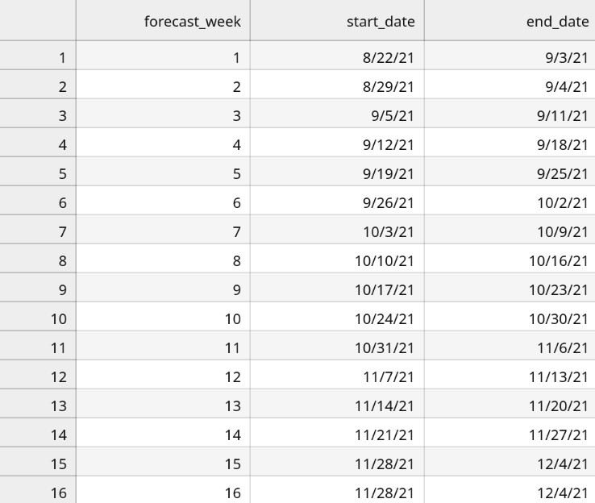

# HAS Tools Forecast Competition
Welcome to the HAS streamflow forecasting competition! Over the course of the semester we will be honing our Python skills and testing them out using weekly streamflow forecasts of the Verde River.  The setup and scoring for the competition is as follows.

____
## Table of Contents:
1. [ Dates](#dates)
1. [ Instructions](#howto)
1. [ Scoring](#points)
1. [ Prizes!](#prizes)
1. [ Evaluator Instructions](#evaluator)
1. [ Evaluator Signup Dates](#evaluatorlist)

___

## Foreacast dates
Forecasts are **due every Monday at noon**. You will be issuing two forecasts the *One Week Forecast* will cover the period from the Sunday to Saturday starting the day after the forecast is due and the *Two Week Forecast* will cover the following Sunday to Saturday period. In both cases you can only use streamflow observations up to the Saturday before you submit (i.e. up to the start of the forecast period).  The table below summarizes the relevant dates for every week of the semester.

___

## How to play:
It sounds complicated, but don't worry it's not that bad:
1. Every week you will generate two streamflow forecasts:
   - **One week forecast**: A forecast for the streamflow next week using the data up to this week.
   - **Two week forecast**: A forecast for the streamflow two weeks from now using the data up to this week.

2. Streamflow forecasts are due by Monday at noon. Late forecasts  will not be accepted for the competition and will receive 0 points. The forecasting dates are provided in the table above.

3. Every week your forecast entries should be entered in your csv in the *forecast_entries* folder. All values should be entered as weekly average flow in **cubic feet per second [cfs]**. Remember to push your updates so they make it into the repo.

___

## How to get points:
First a disclaimer: Note that this scoring is only for the forecasting competition. For your class grade, submitting a forecast on time according to the instructions for the week will give you full credit regardless of how well your forecast rates with respect to others.

That said there will be prizes for the forecast competition (described below) and the scoring will be follows:

 - 2 points to the closest weekly forecast and 1 point to the second and third place forecasts awarded every week (ties are allowed and in that case all tied parties gets the same points)
 - 2 points to the closest 2 week forecast and 1 point to the second and third place forecasts awarded every week (ties are allowed and in that case all tied parties gets the same points)
 - 3 points to be awarded by the evaluator for the week to three *different* people based on whatever criteria the evaluator chooses (literally anything -- most wrong, best consistency between forecasts, most extreme forecast, greatest difference in one week vs two week performance). The only constraints are: (1) the evaluator cannot give points to themselves or the top three students on the current leaderboard and (2) they must use a phython script to determine their bonus points and show their work (e.g. a graph or a table)

*NOTE: I reserve the right to change the rules and award bonus points as I see fit throughout the semester to keep things interesting :)*

 ___
 
 # Prizes
1. Every week the top scorer (or scorers if its a tie) for that week (i.e. just the points being awarded in the week not the overall score) will get a free pass on the written portion of the following week's forecast assignment. Winners will still do the assignment and submit your forecast but can skip the written explanation part. The free pass is only good for the week following the winning.

2. At the end of sections two and three, the top three scorers overall will get an additional free pass on a writing assignment to be used any week they want in addition to three bonus points to be distributed to anyone other than themselves however they see fit.

3. At the end of semester the overall winner will be crowned and they will get a 5% bump on their overall course grade. Second and third place will receive a 3% bump.

 ___

# Evaluator Job Description :

Each week one or two people will be assigned the job of 'Evaluator'. Your job description is as follows. Note that for your development tasks you should create a branch and then do a pull request when you are ready to merge them in.

1. **'Git' oriented**. Spend some time getting familiar with the structure of the forecast repo.  Make sure you are comfortable with the setup and what you will be doing so you can ask any questions the week before.
  -  The folder `evaluation_scripts` contains all of the python scripts used to evaluate forecasts. *Take time to understand the structure of this folder. The best place to get started is by looking at the `readme.md` contained within this folder.*

2. **Create a Branch for your work**. See the evaluator instructions above for more details on this. It's best not to create your branch until the Wednesday before you assignment is due so that previous weeks work can be merged in first.

3. **Run the forecast evaluation scripts to score the weekly forecasts** after the forecast submission deadline (noon on Monday). You will be evaluating two forecasts (1) the one week forecast from last week and (2) the two week forecast from  two weeks ago

4. **Assign your bonus points**.  You can use literally whatever criteria you want to assign bonus  points as long as you provide some rational for how you did it, and only use python to evaluate whatever criteria you choose.  Also, note the scoring rules above that you can't give bonus points to  yourself of anyone already receiving points in a given week. Your analysis should be submitted in a separate python script named: `"`bonus_weekx.py` in the `evaluation_scripts/bonus` folder.

5. **Update the scoreboard, seasonal forecast leaders and weekly points awarded** in the `Scoreboard.md` file

6.  **Make a short presentation for Tuesday class.**  Your slides should  include the following (1) summarize the points awarded this week, (2) the current scores and how they changed, (3) how you awarded your bonus points and, (4) provide a summary of some component of the evaluation scripts that relate  to what we have been learning.

7.  **Submit a pull request to merge your branch back into the master** this should be done before class on Tuesday.

**Note 1:** *You can start working on your bonus analysis script before the forecasts have actually been submitted and just run it after Monday at noon.*

**Note 2:** *Refer to the readme in the evaluation_scripts folder for step  by step instructions on running the analysis*.
 ___
 
 # Evaluator Assignments
 ## TO DO!!!
